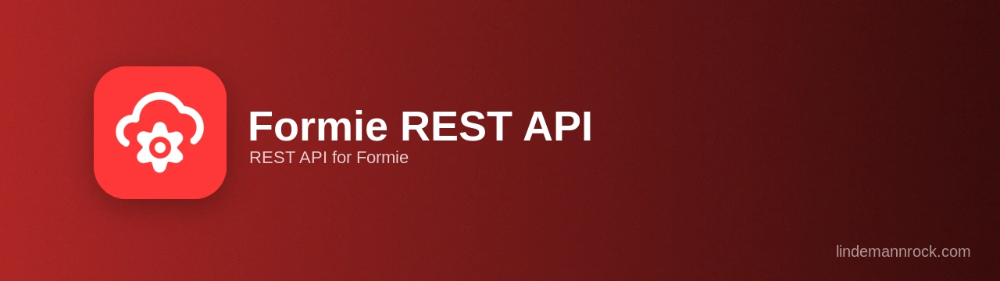

# Formie REST API Plugin

[](https://packagist.org/packages/lindemannrock/craft-formie-rest-api)
[](https://craftcms.com/)
[](https://verbb.io/craft-plugins/formie)
[](https://php.net/)
[](LICENSE)

A REST API plugin for Craft CMS that exposes Formie forms and submissions through authenticated REST endpoints. Designed for external systems (e.g. SAP, BI tools, partner integrations) that need structured form data over HTTP.

> **Note on GraphQL:** Formie ships with its own GraphQL schema at Craft's `/api` endpoint. This plugin does **not** add GraphQL — it adds a separate REST API with its own auth (`X-API-Key`), rate limiting, and access logging. If you want GraphQL, use Formie's built-in support directly.

## License

This is a commercial plugin licensed under the [Craft License](https://craftcms.github.io/license/). It will be available on the [Craft Plugin Store](https://plugins.craftcms.com) soon. See [LICENSE.md](LICENSE.md) for details.

## ⚠️ Pre-Release

This plugin is in active development and not yet available on the Craft Plugin Store. Features and APIs may change before the initial public release.

## Features

- **REST endpoints** — list and read Formie forms and submissions as JSON
- **CP-managed API keys** — one key per consumer, with per-key form scoping, submissions toggle, expiry, and an enable switch
- **API-key authentication** — via the `X-API-Key` header
- **HMAC request signing** — optional per key (replay + tamper protection)
- **IP whitelist** — optional per key (IPv4/IPv6 + CIDR)
- **Rate limiting** — per-key hourly budget with `X-RateLimit-*` headers and `429` on exceed
- **Access logging** — every request logged via the Logging Library
- **In-CP test page** — try endpoints and download a Postman collection without leaving Craft
- **Translated CP UI** — 12 languages

## Requirements

- Craft CMS 5.0 or greater
- PHP 8.2 or greater
- [Formie](https://verbb.io/craft-plugins/formie) 3.0 or greater

## Installation

### Via Composer

```bash
composer require lindemannrock/craft-formie-rest-api
```

```bash
php craft plugin/install formie-rest-api
```

### Using DDEV

```bash
ddev composer require lindemannrock/craft-formie-rest-api
```

```bash
ddev craft plugin/install formie-rest-api
```

## Documentation

Full documentation is available in the [docs](docs/) folder.

## Support

- **Issues**: [GitHub Issues](https://github.com/LindemannRock/craft-formie-rest-api/issues)
- **Email**: [support@lindemannrock.com](mailto:support@lindemannrock.com)

## License

This plugin is licensed under the [Craft License](https://craftcms.github.io/license/). See [LICENSE.md](LICENSE.md) for details.

---

Developed by [LindemannRock](https://lindemannrock.com)

Built for use with [Formie](https://verbb.io/craft-plugins/formie) by Verbb
